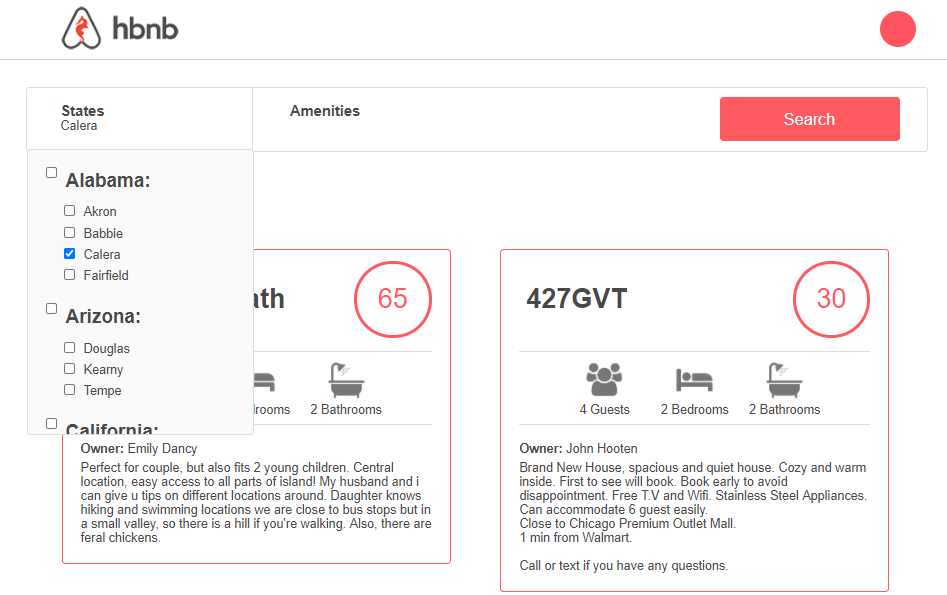
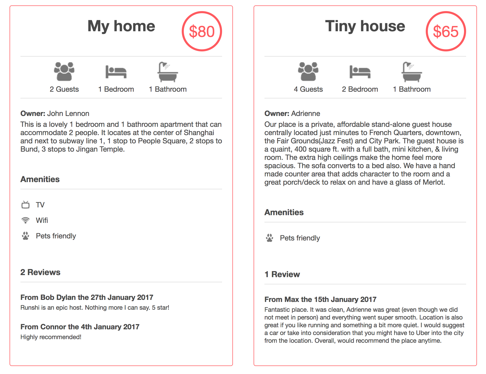

# AirBnB Clone


## Description :book:

Holbertonbnb is a complete full-stack web application, integrating a MySQL database and Flask RESTful API with a dynamic HTML5/CSS3/jQuery front-end.


This repository contains the last version of the AirBnB clone where the Dinamic Website was implemented. You can check out the old versions and features in next repositories.

- [AirBnB Clone v1](https://github.com/arturovictoriar/AirBnB_clone)
- [AirBnB Clone v2](https://github.com/arturovictoriar/AirBnB_clone_v2)
- [AirBnB Clone v3](https://github.com/arturovictoriar/AirBnB_clone_v3)

## Dependencies and Installation :couple:

Application:

| Tool/Library | Version |
| ------------ | ------- |
| Python       | ^3.6.4  |
| MySQL        | ^5.6.0  |
| Flask        | ^1.0.3  |
| flasgger     | ^0.9.2  |
| Flask-Cors   | ^3.0.8  |
| mysqlclient  | ^1.3.10 |
| SQLAlchemy   | ^1.3.5  |

Deployment:

| Tool/Library | Version |
| ------------ | ------- |
| Python       | ^3.7.3  |
| gunicorn     | ^19.9.0 |
| Fabric       | ^2.4.0  |
| Puppet       | ^5.4.0  |

Once you have all the previous dependencies installed in your machine you have to run the backend and frontend services.

- Go to "AirBnB_v4" folder and execute the frontend service

```console
foo@bar:~$ ~/AirBnB_v4$ HBNB_MYSQL_USER=hbnb_dev HBNB_MYSQL_PWD=hbnb_dev_pwd HBNB_MYSQL_HOST=localhost HBNB_MYSQL_DB=hbnb_dev_db HBNB_TYPE_STORAGE=db python3 -m web_dynamic.100-hbnb
* Running on http://0.0.0.0:5000/ (Press CTRL+C to quit)
....
```

- In the "AirBnB_v4" folder, execute the backend service

```console
foo@bar:~$ ~/AirBnB_v4$ HBNB_MYSQL_USER=hbnb_dev HBNB_MYSQL_PWD=hbnb_dev_pwd HBNB_MYSQL_HOST=localhost HBNB_MYSQL_DB=hbnb_dev_db HBNB_TYPE_STORAGE=db HBNB_API_PORT=5001 python3 -m api.v1.app
...
```

- Note1: the frontend runs in host 0.0.0.0 port 5000.
- Note2: the backend runs in host 0.0.0.0, port 5001.

## Usage :open_file_folder:

0. Choose the States and Cities


1. Choose the Amenities


2. Wacth all the rooms and houses availables with your preferencies.


## Support :email:

LinkedIn:

- [Arturo Victoria Rincon](https://www.linkedin.com/in/arturovictoriar/)

Twitter:

- [Arturo Victoria Rincon](https://twitter.com/arturovictoriar)

Portfolio website:

- [Arturo Victoria Rincon](http://arturovictoriar.github.io/)

## Authors and acknowledgment :school:

Arturo Victoria Rincon is Mechatronics Engineer with innate leadership and adaptability skills. Focused on developing software to improve people's quality of life using tools such as Python, Javascript, C, and C ++.

## Bugs :bug:

No known bugs at this time. 

## License :warning:
Public Domain. No copy write protection.

## Related projects :grey_question:

- [AirBnB Clone v1](https://github.com/arturovictoriar/AirBnB_clone)
- [AirBnB Clone v2](https://github.com/arturovictoriar/AirBnB_clone_v2)
- [AirBnB Clone v3](https://github.com/arturovictoriar/AirBnB_clone_v3)

## Authors :black_nib:
- Alexa Orrico - [Github](https://github.com/alexaorrico) / [Twitter](https://twitter.com/alexa_orrico)  
- Jennifer Huang - [Github](https://github.com/jhuang10123) / [Twitter](https://twitter.com/earthtojhuang)  
- Jhoan Zamora - [Github](https://github.com/jzamora5) / [Twitter](https://twitter.com/JhoanZamora10)  
- David Ovalle - [Github](https://github.com/Nukemenonai) / [Twitter](https://twitter.com/disartDave)
- Arturo Victoria - [Github](https://github.com/arturovictoriar) / [Twitter](https://twitter.com/arturovictoriar)
- Orlando Gomez - [Github](https://github.com/oran2527) / [Twitter](https://twitter.com/orlago)

Second part of Airbnb: Joann Vuong
